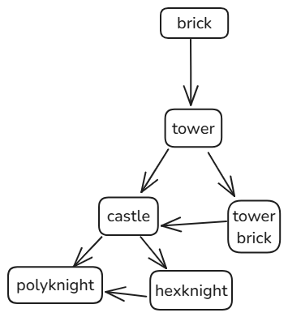

# toms-comp
my technology hierarchy

|language| Description | ran on | analogous to |
| - | - | - | - |
| [brick](brick.md) | assembly language | [hardware](hardbrick.md) | x64, ARM |
| [tower](tower.md) | [stack language](stacklanguage.md) | [brick](brick.md),[hardware](hardtower.md) | LLVM |
| [towerbrick](towerbrick.md) | array handling library | [tower](tower.md)| C++ |
| [castle](castle.md) | modern language | [tower](tower.md) and [towerbrick](towerbrick.md) | C |
| [hexknight](hexknight.md)| modern language | [castle](castle.md),[tower](tower.md)| Python | 
| [polyknight](polyknight.md) | drawing library | [castle](castle.md),[tower](tower.md) | p5.js, turtle or openGL (WIP) | 

*you can see the theme*

## tech tree

